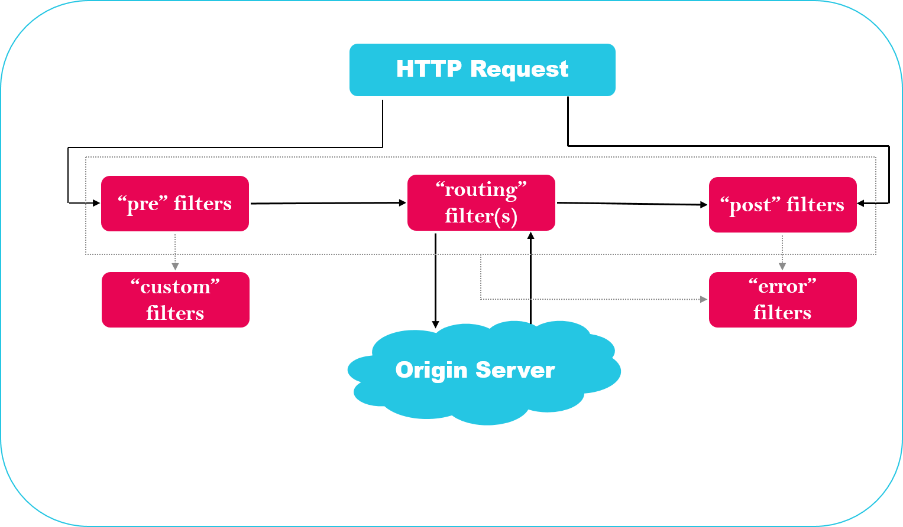

## 一、zuul的过滤器类型与请求生命周期
	
> zuul大部分功能是通过过滤器来实现。zuul定义了四种标准过滤器类型，这些过滤器类型对应于请求的典型生命周期。
	
* 1、PRE：这种过滤器在请求被路由之前调用。我们可利用这种过滤器实现身份验证，在集群中选择请求的微服务，记录调试信息等
		
* 2、ROUTING：这种过滤器将请求路由到微服务。这种过滤器用于构建发送给微服务的请求，并使用ApacheHttpClient 或Netflix Ribbon请求微服务
		
* 3、POST：这种过滤器在路由到微服务以后执行。这种过滤器可用来为响应添加标准的HTTP Header、收集统计信息和指标、将响应从微服务发送给客户端。
		
* 4、ERROR：在其他阶段发生错误时执行该过滤器
		
> 除了默认的过滤器类型，Zuul还允许我们创建自定义的过滤器类型。例如，我们可以定制一种Static类型的过滤器，直接在Zuul中生成响应，而不将请求转发到后端的微服务
		
> Zuul请求的生命周期如图所示，该图详细描述了各种类型的过滤执行顺序
 

## 二、测试顺序
	
* 1、启动 microservice-discovery-eureka 模块服务，启动1个端口8761；
* 2、启动 microservice-gateway-zuul-filter 模块服务，启动1个端口8042；
* 3、启动 microservice-provider-user 模块服务，启动1个端口7901；
* 4、新起网页页签，输入 http://localhost:8042/zuul/microservice-provider-user/msprovider/userContro/findUser/1
    + 4.1 com.baihoo.filter.PreZuulFilter.shouldFilter() 返回 true
		- 4.1.1  优先执行  microservice-gateway-zuul-filter 中的 com.baihoo.filter.PreZuulFilter.run()方法
		- 4.1.2  然后在代理执行 microservice-provider-user 中的 com.baihoomuch.cloud.controller.UserController.findUser(Long)方法
	+ 4.2 com.baihoo.filter.PreZuulFilter.shouldFilter() 返回 false
		- 4.2.1  直接代理执行 microservice-provider-user 中的 com.baihoomuch.cloud.controller.UserController.findUser(Long)方法
* 5、zuul 核心API已经为我们实现了大部分常用过滤功能，那么如何禁用呢？
	+ Zuul for Spring Cloud在代理和服务器模式下都默认启用了许多ZuulFilter bean。有关可以启用的过滤器列表，可以参阅Zuul过
	滤器包 spring-cloud/spring-cloud-netflix/spring-cloud-netflix-zuul 。
	+ 如果要禁用一个，在 application.yaml 文件中设置 zuul.<SimpleClassName>.<filterType>.disable=true。 
	+ 按照惯例，Zuul.过滤器.Zuul过滤器类型。例如，要禁用 org.springframework.cloud.netflix.zuul.filters.post.SendResponseFilter ，
	在application.yaml文件中设置如下：
        ```$xslt
        zuul.SendResponseFilter.post.disable = true
        ```
			