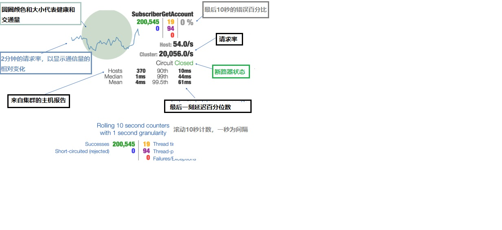

## 一、hystrix-dashboard 聚合Hystrix的各个断路器，仪表板图形化

> 当前工程是,聚合Hystrix的各个断路器，仪表板图形化详情展示。Hystrix Dashboard时监控Hystrix的熔断器的一个组件，提供了数据
监控和友好的展示界面

> hystrix的主要优点之一是它收集了关于每个hystrix命令[ @HystrixCommand("fallbackMethodName") ]的一组度量。Hystrix仪表
板以有效的方式显示每个断路器的健康状况。

>官方地址: https://github.com/Netflix-Skunkworks/hystrix-dashboard , https://github.com/Netflix-Skunkworks/hystrix-dashboard/wiki

## 二、测试顺序
* 1、启动  microservice-discovery-eureka 模块服务，启动端口8761；
* 2、启动  microservice-provider-user 模块服务，启动端口7901；
* 3、启动  microservice-hystrix-dashboard 模块服务，启动端口8900；
    + 网页页签，输入 http://localhost:8900/hystrix/，网页显示内容如下：
        ```
            ------------------------------------------------------------
            Hystrix Dashboard 的 WEB 页面；输入 断路器监听URL 的输入框
            ------------------------------------------------------------
        ```
* 4、启动  microservice-consumer-movie-feign-with-hystrix-hystrix-factory 模块服务，启动端口7979；
	+ 网页页签，输入 http://localhost:7919/msmovie/contro/movie/1，敲回车访问多次
	+ 网页页签，输入 http://localhost:9005/actuator/hystrix.stream,(断路器监听URL) 网页显示内容如下：
        ```
            ------------------------------------------------------------
            ping: 
            
            data: {"type":"HystrixCommand","name":"UserFeignClient#findUser(Long)",
            "group":"microservice-provider-user", ......
            ......
            ------------------------------------------------------------
        ```
	+ Hystrix Dashboard 的 WEB 页面；输入 断路器监听URL,结果如图：
        
* 5、启动  microservice-consumer-movie-ribbon-with-hystrix-propagating 模块服务，启动端口7917；
	+ 网页页签，输入 http://localhost:7917/msmovie/contro/movie/1，敲回车访问多次
	+ 网页页签，输入 http://localhost:9003/actuator/hystrix.stream ,(断路器监听URL) 网页显示内容如下：
        ```
            ------------------------------------------------------------
            ping: 
            
            data: {"type":"HystrixCommand","name":"UserFeignClient#findUser(Long)",
            "group":"microservice-provider-user", ......
            ......
            ------------------------------------------------------------
        ```
	+ Hystrix Dashboard 的 WEB 页面；输入 断路器监听URL,结果如图：
        
## 三、测试总结
* 1、要将含有hystrix的项目工程，其断路器详情图表化展示的web端构建，引入依赖 
spring-cloud-starter-netflix-hystrix-dashboard 和 spring-boot-starter-actuator
* 2、在程序的启动类加上注解 **@EnableHystrixDashboard** 能够启用Hystrix仪表板，图形化监控
