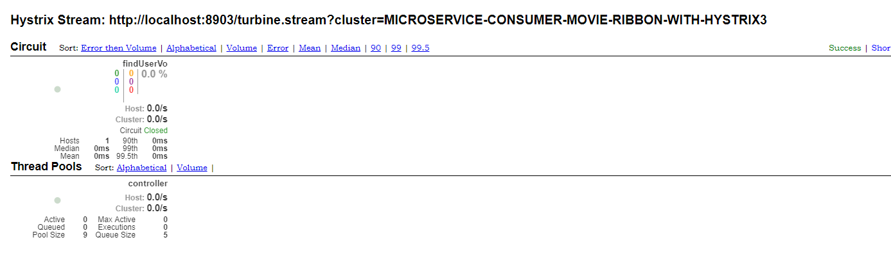
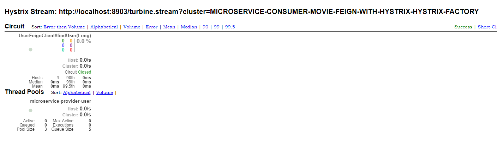

## 一、hystrix-dashboard 聚合Hystrix的各个断路器，仪表板图形化

> 当前工程是,聚合Hystrix的各个断路器，仪表板图形化详情展示。Hystrix Dashboard时监控Hystrix的熔断器的一个组件，提供了数据
监控和友好的展示界面

> hystrix的主要优点之一是它收集了关于每个hystrix命令[ @HystrixCommand("fallbackMethodName") ]的一组度量。Hystrix仪表
板以有效的方式显示每个断路器的健康状况。

>官方地址: https://github.com/Netflix-Skunkworks/hystrix-dashboard , https://github.com/Netflix-Skunkworks/hystrix-dashboard/wiki

						
## 二、使用Turbine聚合监控
> 在使用Hystrix Dashboard组件监控服务的熔断器状况时，每个服务都有一个Hystrix Dashboard主页，服务数量过多时，监控非常不
方便。Netflix开源了另一个组件Turbine，用于聚合多个Hystrix Dashboard，将数据显示在一个页面上，集中监控。

## 三、测试顺序
* 1、启动  microservice-discovery-eureka 模块服务，启动端口8761；
* 2、启动  microservice-provider-user 模块服务，启动端口7901；
* 3、启动  microservice-hystrix-turbine3 模块服务，启动端口8903；
    + 网页页签，输入 [http://localhost:8903/hystrix/]，网页显示内容如下：
        ```
            ------------------------------------------------------------
            Hystrix Dashboard 的 WEB 页面；输入 断路器监听URL 的输入框
            ------------------------------------------------------------
        ```
* 4、启动  microservice-consumer-movie-ribbon-with-hystrix3 模块服务，启动端口7921；
	+ 网页页签，输入 [http://localhost:7921/msmovie/contro/movie/1]，敲回车访问多次
	+ 网页页签，输入 [http://localhost:7921/msmovie/actuator/hystrix.stream],(断路器监听URL) 网页显示内容如下：
        ```
            ------------------------------------------------------------
            ping: 
            
            data: {"type":"HystrixCommand","name":"UserFeignClient#findUser(Long)",
            "group":"microservice-provider-user", ......
            ......
            ------------------------------------------------------------
        ```
* 5、启动  microservice-consumer-movie-feign-with-hystrix-hystrix-factory 模块服务，启动端口7919；
	+ 网页页签，输入 [http://localhost:7919/msmovie/contro/movie/1]，敲回车访问多次
	+ 网页页签，输入 [http://localhost:9005/actuator/hystrix.stream],(断路器监听URL) 网页显示内容如下：
        ```
            ------------------------------------------------------------
            ping: 
            
            data: {"type":"HystrixCommand","name":"UserFeignClient#findUser(Long)",
            "group":"microservice-provider-user", ......
            ......
            ------------------------------------------------------------
        ```
* 6、网页页签 [http://localhost:8903/hystrix/] 的 Hystrix Dashboard 的 WEB 页面；输入 断路器监听URL
	+ 输入框输入 Hystrix Stream : http://localhost:8903/turbine.stream?cluster=MICROSERVICE-CONSUMER-MOVIE-RIBBON-WITH-HYSTRIX3
	+  
	
* 7、网页页签 [http://localhost:8903/hystrix/] 的 Hystrix Dashboard 的 WEB 页面；输入 断路器监听URL
	+ 输入框输入 Hystrix Stream : http://localhost:8903/turbine.stream?cluster=MICROSERVICE-CONSUMER-MOVIE-FEIGN-WITH-HYSTRIX-HYSTRIX-FACTORY
	+  
	
## 四、测试总结
* 1、若要在项目中包含 hystrix 仪表板，聚合监控，引入依赖 
spring-cloud-starter-netflix-turbine 和 spring-boot-starter-actuator
* 2、在程序的启动类加上注解 **@EnableHystrixDashboard** 能够启用Hystrix仪表板，图形化监控
* 3、在程序的启动类加上注解 **@EnableTurbine** 能够启用集合多个 Hystrix 仪表板，聚合监控
* 4、在 application.yml 中配置应用名 microservice-hystrix-turbine2 注册到 eureka server 端
* 5、在 application.yml 中配置 turbine 需要集群监控的应用名，详情配置如下：
    ```
    #actuator端口
    management:
    #  server:
    #    port: 8010
      endpoints:
        web:
    #      base-path: /monitor #修改访问路径  2.0之前默认是/   2.0默认是 /actuator  可以通过这个属性值修改
          exposure:
            include: '*'  # 开放所有页面节点  默认只开启了health、info两个节点
      endpoint:
        health:
          show-details: always
    turbine:
      aggregator:
        # 指定集群配置的应用名
        cluster-config:
        - MICROSERVICE-CONSUMER-MOVIE-FEIGN-WITH-HYSTRIX-HYSTRIX-FACTORY
        - MICROSERVICE-CONSUMER-MOVIE-RIBBON-WITH-HYSTRIX3
      # 指定监控的应用名
      app-config: microservice-consumer-movie-feign-with-hystrix-hystrix-factory,microservice-consumer-movie-ribbon-with-hystrix3
      # 特例应用 部分服务应用配置了 context-path，部分没有配置 context-path
      instanceUrlSuffix:
        MICROSERVICE-CONSUMER-MOVIE-RIBBON-WITH-HYSTRIX3: msmovie/actuator/hystrix.stream
    ```  